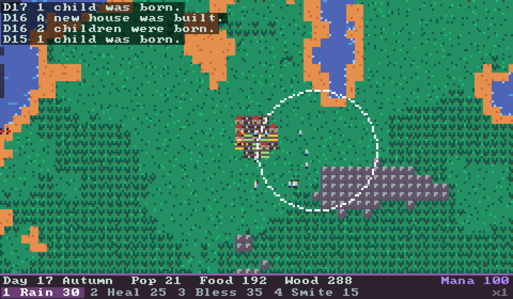

# A2D Village Sim

A tiny WorldBox-style god game in 2D pixel art, with one twist: **you can't win, you can only last.**
Your villagers farm, chop wood, build houses and raise kids on their own. The world keeps throwing
droughts, plagues, wildfires, raiders, locusts and blizzards at them, more often the longer you survive.
You spend mana on four powers to keep them going. Your score is the number of days your civilization survives.



## Controls

| Key / mouse | Action |
|---|---|
| `1`–`4` | Pick a power: Rain (30 mana), Heal (25), Bless (35), Smite (15) |
| Left click | Cast the selected power at the cursor |
| Mouse wheel | Zoom (1x–4x) |
| WASD / arrows, right or middle drag | Pan |
| `H` | Jump back to the village hall |
| `Space` | Pause |
| `+` / `-` | Sim speed x1 to x8 |
| `R` | New world after game over (`Shift+R` any time) |

What each power does: **Rain** ends droughts and puts out fires, **Heal** cures plague and restores health,
**Bless** instantly ripens farms (and regrows locust-stripped fields), **Smite** kills raiders with lightning.
Winter needs firewood, so keep an eye on wood as well as food.

## Build

Needs CMake 3.20+ and a C++17 compiler. SDL3 is used from your system if found, otherwise it is downloaded and built automatically.

```sh
# macOS (optional, faster first build)
brew install sdl3

cmake -S . -B build -DCMAKE_BUILD_TYPE=Release
cmake --build build -j
./build/villagesim            # play
./build/villagesim_test       # balance/self-test (also: ctest --test-dir build)
```

`./build/villagesim --seed 7 --days 16 --shot out.bmp` renders one frame after N days without opening a window.

## Layout

- `src/world.*` – the simulation (no SDL): map gen, villagers, jobs, seasons, disasters, powers.
- `src/render.*` – draws the world into a pixel buffer (4×4 px tiles, Resurrect 64 colours, day/night tint).
- `src/main.cpp` – SDL3 window, input, camera, HUD.
- `src/selftest.cpp` – checks that a peaceful village grows and that an unattended one falls, but not instantly.
