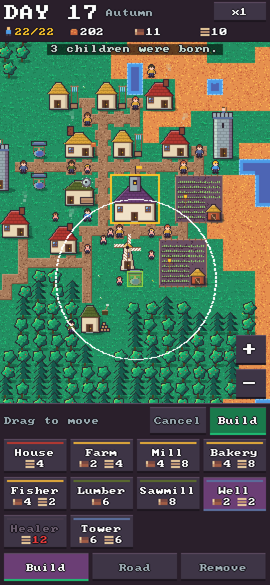
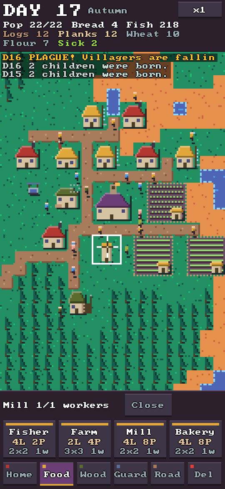
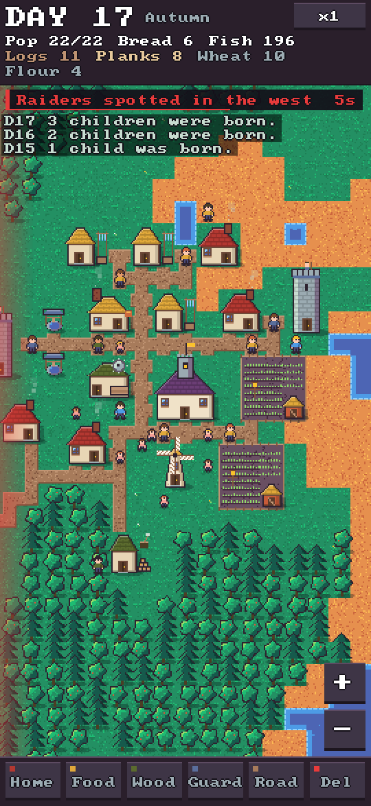
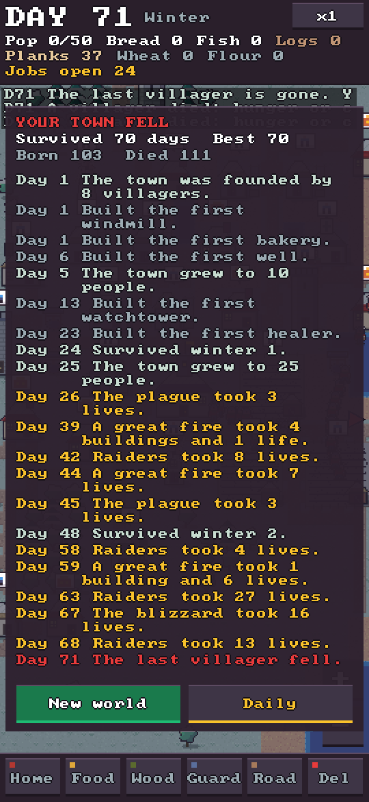
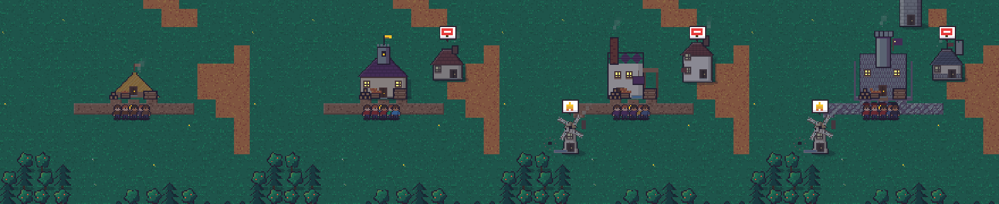

# A2D Village Sim

An Anno-style survival town builder in 2D pixel art for **portrait phones**. **You can't win, you can only last.**
You place buildings and roads; villagers staff them and run the production chains. The world keeps throwing
droughts, plagues, wildfires, raiders, locusts and blizzards at your town, more often the longer you survive.
There are no god powers: wells, healers and watchtowers are your only protection. Your score is the number of days survived.

    

## How it plays

- **Roads matter.** A building only works when a road connects it to the Town Hall. Disconnected buildings go grey with a road-sign bubble.
- **Chains:** Lumber Camp chops trees into logs, the Sawmill turns logs into planks (it keeps a few logs back for firewood and roads).
  Wheat Farm grows wheat (not in winter), the Windmill grinds flour, the Bakery bakes bread. Fishers catch fish all year.
- **People:** each villager eats one bread or fish per day. Houses (4 beds) must be on a road. Children are born when there is room and a food surplus, and start working at 6 days old.
  Workers fill jobs by priority (food first). A building stuck on a missing good shows that good in a bubble.
- **Winter** burns logs as firewood; cold houses show a firewood bubble.
- **Safety:** a Well puts out fires and stops them spreading in its radius, a Healer cures plague, a Watchtower shoots raiders.
  While placing one you see its coverage circle and the houses it would cover light up.
- **Ages:** Camp → Village → Craft → Fortified. Like Empire Earth 2, you buy the next age at the town hall (Advance button) once you have the prereq buildings and the goods. Until you pay, new buildings keep the current age's look. Each age changes silhouettes, not only paint: Camp is A-frame thatch, Village is gabled cottages with a bell tower, Craft is sawtooth workshop halls with chimneys and docks, Fortified is a stone keep with wall stubs, banners and cobble roads. A short flash ceremony plays when you advance. Village shingles stop fire spreading across roofs, Craft chimneys cut winter firewood, and Fortified stone makes raiders bounce (and cobble slows them). The age name sits next to the season.
- **Stock on the map:** the top bar only shows people (and sick villagers). Goods sit as piles instead: logs and planks in front of the town hall and at lumber camps and sawmills, wheat sheaves by the farm barn, flour sacks at the mill, and crates of bread or fish. The town hall piles grow in fixed steps: one log per 10 logs (up to 6), one board per 10 planks (up to 4), and one loaf or fish per 20 food (up to 6). A pile that has hit its cap sparkles. Tap the hall, or any building that holds goods, to see exact numbers above the Close button. A red LOW chip appears only when food is short, or when firewood is short in winter. Build cards still show their cost in red when you can't afford it.
- **Warnings:** every disaster is announced 8 game seconds before it hits, with a countdown chip under the day counter, a glow on the edge raiders come from, and a tint for fire, plague or blizzard. A warning drops the speed back to x1.
- **It gets harder:** disasters come more often and hit harder as the days pass, and after day 35 a second one can arrive in the afternoon. Every town falls eventually.
- **The town's story:** when your town falls, the game-over screen tells its story day by day: founding, key buildings, growth, winters survived, the disasters that hit hardest, and the end.
- **Daily run:** the start screen has a big Daily button (also on the game-over screen, or `--daily`). It starts today's world, the same for everyone on the same UTC date, with its own best score. The sim uses its own random-number mapping so desktop and phone builds generate the same world from one seed.
- Roof colours match the stripe on each build card: red-brown homes, straw food, green-brown wood, slate safety.
- Buildings unlock as you go: a new world offers house, farm, fisher and lumber camp. The mill appears once you have wheat, the bakery once you have flour, the sawmill once you have a lumber camp, the well on day 3, and the healer and tower on day 8 or as soon as sickness or raiders show up. New cards get a small yellow dot.

## Controls

Portrait-only on a 64×120 tile map; the layout adapts to any phone size (whole-number pixel scale, short side about 270 game pixels, safe-area aware).

**Touch:** the build drawer sits at the bottom. It has three buttons: Build, Road and Remove. Build opens one grid of cards ordered along the production chains; tap a card (greyed out when you can't afford it),
drag the see-through ghost (it floats above your thumb, green where it fits and red where it doesn't), then press **Build** or **Cancel**.
With **Road** selected, drag to draw a road; the live cost shows while you drag. With **Remove** selected, tap a building or road, then tap again or press Remove (half refund).
With no tool selected, one finger pans and a tap shows a building's status. Two fingers always pan and pinch-zoom.
Arrows at the screen edge point to off-screen fire (orange), plague (green) and raiders (red). The game pauses when the app goes to the background.

**Desktop (for testing):** click works like a tap, and clicking places a building directly. The ghost follows the mouse, left-drag draws roads,
right or middle drag pans, the wheel zooms, `Esc` cancels, `Space` pauses, `+`/`-` changes speed, `H` jumps to the hall and `Shift+R` starts a new world.

## Build

Needs CMake 3.20+ and a C++17 compiler. SDL3 is used from your system if found, otherwise it is downloaded and built automatically.

```sh
# macOS (optional, faster first build)
brew install sdl3

cmake -S . -B build -DCMAKE_BUILD_TYPE=Release
cmake --build build -j
./build/villagesim            # play
./build/villagesim_test       # balance/self-test (also: ctest --test-dir build)
```

`./build/villagesim --seed 10 --days 16 --demo --ui well --size 540x1170 --shot out.bmp` renders one frame at a phone resolution without opening a window. `--demo` lets a scripted player build the town first, and `--ui none|well|road|info` picks what the UI shows. `--size WxH` also sets the desktop window size, so you can preview phone layouts.

Android/iOS packaging isn't set up yet; SDL3 supports both, so that's the next build step.

## Layout

- `src/world.*`: the simulation (no SDL), covering map gen, buildings, roads, production chains, villagers, seasons and disasters.
- `src/render.*`: draws the world into a pixel buffer (16×16 px tiles, Resurrect 64 colours, day/night tint, ghost, coverage circles, need bubbles).
- `src/main.cpp`: SDL3 window, touch and mouse input, camera, top bar and build drawer.
- `src/autoplay.hpp`: a scripted player used by the self-test and `--demo` screenshots.
- `src/selftest.cpp`: balance checks. Chains produce, a peaceful town survives 60 days, an idle town falls (but not instantly), and safety buildings help against disasters.
